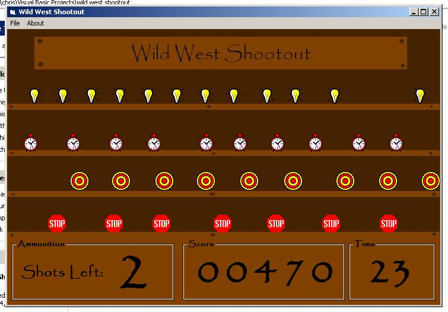



## A Arcade Shootout Game

### Description

a arcade style game in which the objective is to shoot as many targets in 30 seconds as possible. targets move at different speeds and directions.
 
### More Info
 

             |
---                |---
**Submitted On**   |2002-12-24 22:13:42
**By**             |[Christopher C\.](https://github.com/Planet-Source-Code/PSCIndex/blob/master/ByAuthor/christopher-c.md)
**Level**          |Beginner
**User Rating**    |4.7 (14 globes from 3 users)
**Compatibility**  |VB 4\.0 \(32\-bit\), VB 5\.0, VB 6\.0
**Category**       |[Games](https://github.com/Planet-Source-Code/PSCIndex/blob/master/ByCategory/games__1-38.md)
**World**          |[Visual Basic](https://github.com/Planet-Source-Code/PSCIndex/blob/master/ByWorld/visual-basic.md)
**Archive File**   |[A\_Arcade\_S15208812302002\.zip](https://github.com/Planet-Source-Code/christopher-c-a-arcade-shootout-game__1-41957/archive/master.zip)

